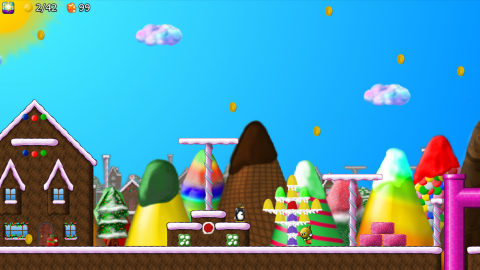

# RocketTux
A penguin with a rocket pack? Sure, why not!  

RocketTux is an easygoing side-scroller game about collecting coins and items. Help Tux navigate his way through the randomly pieced together levels, managing his boosts, earning Cubimals for bonuses, and avoiding the ever mischievous Nolok's walking bombs and other "hilarious machines"...

## Download
- Latest Release Version: 0.6.5 (2021.11.28)
- **Windows:** See the [releases](https://github.com/Tatwi/RocketTux/releases) page.
- **Linux:** See the [releases](https://github.com/Tatwi/RocketTux/releases) page.
- Previous Versions can be found in my [Google Drive](https://drive.google.com/open?id=1HIeXdRdk2E9728L978p4-uPapfudT1VS).
- MacOS: Not supported.
- Android/iOS: Not supported.

**Click the image above to watch a demo video**  
*Sorry the quality sucks, it's the best I could do*

## System Requirements
I can verify the game works fine using the following specs:

- **CPU:** AMD FX 8320, Intel Core2 Q8200, Intel Celeron N3450
- **Graphics:** Nvidia Geforce 1660, AMD R9 270, Intel HD Graphics 500 
- **RAM:** 4GB

The game _should_ run fine on even the oldest Chromebooks, but with the ever changing nature of web browsers, I simply can't guarantee that to always be true. That said, the packaged desktop app will always run well using the above specs.  

## About Development
The game is quite playable and nearly complete at this stage. See the Development Checklist below for details on what it is currently implemented.  

- **Status:** Playable, just missing some features
- **Expected Completion Date:** Summer 2022
- Programmed from scratch using [Phaser CE](https://github.com/photonstorm/phaser-ce).
- Based on visual art assets from [SuperTux](https://supertuxproject.org/) and [Glitch](https://www.glitchthegame.com/public-domain-game-art/).
- RocketTux is its own unique game, not a clone of Supertux or other platformers.
- Created with Linux Mint 17 and Windows 10 64Bit on an AMD FX-8320 based desktop PC. 
- Originally intended to be a Chrome App and optimized for low end Chromebooks, but it's now intended to be run on a desktop PC. 
- Packaged as a native application for Windows and Linux using [NW.js](https://github.com/nwjs/nw.js), which is based on [Node.js](https://nodejs.org/en/about/) and the [Chromium](https://www.chromium.org/Home) web browser.
- **No advertisements, no subscriptions, no micro-transaction, and no purchase fees.** Just free, open source fun!

## Target Audience
RocketTux is designed for kids and light-hearted adults alike. It's not meant to be a difficult or frustrating game. Students can play the game at school and browse or modify the source code to learn about programming.

## Story
That naughty Nolok has been up to no good, again! This time he and his minions decided it would be hilarious if they took people's everyday items and hid them inside of magic blocks all over the world. Someone has to clean up Nolok's mess and Tux is always up for a challenge. Of course, Nolok isn't going to make it easy for him, even though he does think that rocket pack thing is cool. Word is that the [Rescue Girlies](https://github.com/Tatwi/RescueGirlies) are also making an effort to reign in Nolok's chaos.

## Gameplay
When the game is finished, the following game play will be available.  

- Boost and fly around collecting coins (to unlock levels and purchase Cubimals) and items to complete quests.
- "Coin Jump" or use boosts to puzzle your way around obstacles.
- Open various blocks (by simply passing over them) that grant items, unlocks, and powerups.
- Use one of 5 types of powerups to customize your game play experience.
- Get bonuses and set preferences by purchasing Cubimals with your coins. If you're really lucky, you might even find one inside a block! Up to four Cubimals can be active at a time, in any combination.
- Randomly generated levels with 26 different map sections per theme and 8 total themes. 
- No death mechanic. If Tux collides with an enemy or an explosion, he gets knocked back and loses some coins from his wallet (unless he is invincible at the time). Easy mode loses fewer coins, where hard mode loses more coins.
- No "murder hobo" lifestyle; Nolok's minions are obstacles to be avoided (you can't kill them, though the bomb guys do explode).
- No time limits. Stop and smell the Fire Flowers!
- No forced movement through levels.
- No need to reach the end of a level to "beat it". In fact, you'll probably go back and forth several times to collect everything. The level ends when you feel like leaving it. You get a bonus for collecting all the coins, but you don't have to collect them all.
- No "secret areas" or other potentially annoying mechanics that you'll need to look up on the Internet just to understand!

### Controls
RocketTux is designed to be used with keyboard and mouse, but you can also use a gamepad to navigate the main menu and play the levels. SNES style is the default gamepad layout, with XBOX360 being the other supported layout. The only difference in the controller selection is that the ABXY buttons are swapped to maintain the thumb positions one would use with the SNES style controller.  

#### Keyboard:  
- **Left/Right Arrows:** Move left and right.
- **Spacebar:** Boost into the air. Provided he doesn't run into anything along the way, a boost will move Tux to the top of the screen.
- **Control:** Small jump that will move Tux up two or three "blocks" (depending on powerups). Only works when standing or running.
- **Up Arrow:** Gain altitude when collecting coins ("coin jump"). Hover when in the air. A small amount of altitude is lost over time.
- **Down Arrow:** Hover when in the air. Do NOT gain altitude when collecting coins (handy for collecting a row of coins). Duck when on the ground.
- **ESC Key:** Exit levels, and the inventory, friends, and help screens.
- **F1:** Toggle tool tips on the main menu, inventory, and friends screens. 
- **Music Controls:** M for mute, Comma for quieter, Period for louder.
- **Mouse:** Used for clicking menu buttons and removing the powerup by clicking its icon (which is the only way to remove it).

#### Gamepad:  
- **DPAD:** Left/Right move Tux left/right. Also used in the main menu, where Up/Down selects difficulty and Left/Right selects the levels. Up/Down are not used when playing in a level.
- **A:** Boost.
- **B:** Small jump.
- **Y:** Maintain height, allowing coin jumps. _Tip: You're meant to hold this with the end of your thumb, thereby making it easy to tab a small jump on the B button with the base of your thumb._
- **X:** Maintain height, but do not allow coin jumps.
- **Start:** Play in main menu, pause/resume in levels.
- **Select:** Choose random level in main menu, exit level on the pause screen.

### Powerups
Powerups are found in purple blocks throughout the world. They persist through level changes and can be seen on the main menu. All powerups, with the exception of the Earth Flower, are lost on contact with an enemy or an explosion.  

- **Star:** Makes Tux fly a bit faster and makes him run at super speed!
- **Fire Flower:** Tux flies even faster than with the Star and he has a chance to gain a boost when collecting coins (to a max of 5 active boosts).
- **Water Flower:** Makes Tux invincible and very lucky, but the powerup is consumed after the first time Tux collides with an enemy or an explosion. Luck affects the outcome of opening boxes, making them more likely to generate positive results.
- **Earth Flower:** Makes Tux completely invincible at the cost of also making him very, very heavy. Tux can only jump 1 block, he will not boost all the way to the top of the level, and he will lose altitude much more quickly.
- **Air Flower:** Makes Tux much lighter, improving his jumps (3 blocks), coin-jumps, and boosts, while also causing him to lose altitude at a slower rate.

### Enemies
- Mr. Bomb: Walks around, preferably on the ground. He is programmed to run, tick, and explode when Tux gets near him. Large blast radius.
- Mr. Short-fuse: Walks around, preferably on the ground. He doesn't have time for ticking, he just explodes! Smaller blast radius.
- Jumpy: Likes to stay in one spot and hop the day away. Invincible, everlasting.
- Woody: Like Jumpy, but made of wood and only found in the forest.
- Rocketboots: Flies around, bouncing off things. He is programmed to explode when Tux gets near him, but he may well blow himself up just by bouncing around. Enormous blast radius.
- Proppy: A special kind of bomb dropped by Nolok when Tux opens orange boxes. Proppy is a bomb who hovers up and down, waiting for Tux to come near. Large blast radius.
- Fightly Fish: These giant fish love to eat penguins. Normally that's the other way around... best to avoid these bad guys if possible!

### Gameplay Tips
- Each map is a puzzle, where the idea is to collect as many coins and items as possible. However, you only have so many boosts and "coin jumps" to get up to the high coins and to get over obstacles. So the biggest tip is to get up to the top of the screen and go back and forth, collecting highest stuff first, then work your way down.
- If you have run out of boosts and you're stuck between obstacles, unable to small-jump out, then that's it for you on that level!
- Don't sweat it if you weren't able to collect all the coins in a level. Yeah, collecting them all kicks you up one tier in bonus coins, but in the grand scheme of things it doesn't matter _that_ much.
- Every 10 coins you collect bumps you up 1 tier in bonus coin rewards. On normal and hard mode, the higher tier bonuses (for longer levels that have higher coin amounts) are much more generous than the lower tier bonuses.

## Wiki
The following are links to documents related to the development and use of the game. Hopefully there is enough information here to help students and hobbyists make sense of how the project is laid out, how to develop for it, and how to use the included tools.

### Running and Building
- [Using a web server in Linux or Windows to host the game](docs/wiki-using_a_webserver.md)
- [Building an executable using NW.js](docs/wiki-building.md)
- [Running the game on a Chromebook](docs/wiki-chromebooks.md)

### Project and Programming
- [Art and release files in my Google Drive](https://drive.google.com/open?id=0By31kDj_eHBcWHdXRlFzdnZIdUU)
- [File structure and types](docs/wiki-file_structure.md)
- [Step by step walk through of the game states](docs/wiki-game_states.md)
- [Explaining the sprite sheet and backgrounds](docs/wiki-sprites.md)
- [Creating map sections using Tiled](docs/wiki-map_section_creation.md)
- [The Prototype of RocketTux](docs/prototype/README.md)  

### Screenshots and Google Drive
- [Screenshots](screenshots): Some fun and helpful screenshots of the game that are located in this repository.
- [Dev Blog Screenshots](https://drive.google.com/open?id=0By31kDj_eHBceXgtS3hvdnJvT0U): My Google Drive folder filled hundreds of screenshots taken during development. Potentially entertaining and informative.
- [My Design Book](https://drive.google.com/drive/folders/0By31kDj_eHBcTjJuNllrdm1wVk0?usp=sharing): Pictures of the my paper notebook (and possibly other misc papers) that I used for most of my design/thinking.
- [GIMP Source Files](https://drive.google.com/drive/folders/0By31kDj_eHBcSmFudlJUcWd3UUU?usp=sharing): The huge, Git-unfriendly GIMP art files that I used to create all of tilemaps, sprites, and other graphics.
- [Google Drive Cache](https://drive.google.com/drive/folders/0By31kDj_eHBcYnlpQjEzZHY4SUU?usp=sharing): All of the folders, including the two above, for files related to _all of my open source projects_ that weren't really appropriate to put in their repositories. There's some other misc RocketTux stuff in here as well.

## Development Checklist
*Last Updated: 2021.12.09*  
This list contains all of the bits and pieces that make up the game. The most current release may not include all of the items that have been checked off. To get the most up to date version, download the Git repository and build it using the builder script (requires BASH in Linux and Windows).  

### Main Menu
- [x] Layout and button art
- [x] Level preview art
- [x] Button highlighting
- [x] Level loading
- [x] Random level selection
- [x] Difficulty setting
- [x] Powerup and coin display
- [x] Replace SlickUI with a custom UI
- [ ] Tooltips

### Friends Menu
- [x] Layout and button art
- [x] Button highlighting
- [x] Friend paging
- [x] Friend quest item requirements
- [x] Friend quest completion
- [x] Friend images
- [ ] Cubimal paging
- [ ] Cubimal unlock costs
- [ ] Cubimal selection
- [ ] Cubimal images
- [ ] H and S button sounds
- [ ] Tooltips

### Inventory Menu
- [x] Layout and button art
- [x] button highlighting
- [x] Inventory paging
- [x] Item selection
- [x] Item selling
- [x] Item donating
- [ ] Item selling toast
- [ ] Item donating toast
- [ ] S and D button sounds
- [ ] Tooltips

### Help Menu
- [ ] Table of contents
- [ ] Content selection
- [ ] General purpose and how to play
- [ ] Movement keys
- [ ] Gamepad defaults
- [ ] Powerups
- [ ] Cubimal bonuses
- [ ] Friend quests
- [ ] Selling and donating items
- [ ] Credits

### Settings Menu
- [x] Game machine colour selection
- [x] Text and highlight colour selection
- [ ] Music volume
- [ ] Disable rocket pack exhaust sound
- [ ] Gamepad selection
- [ ] Gamepad button remapping

### Level Themes
- [x] Candyland Tilemap art
- [x] Candyland Map/level sections
- [x] Snow1 Tilemap art
- [x] Snow1 Map/level sections
- [x] Snow2 Tilemap art
- [ ] Snow2 Map/level sections 16/26
- [x] Snow3 Tilemap art
- [x] Snow3 Map/level sections
- [x] Forest1 Tilemap art
- [X] Forest1 Map/level sections
- [x] Forest2 Tilemap art
- [ ] Forest2 Map/level sections 16/26
- [x] Beach Tilemap art
- [x] Beach Map/level sections
- [x] Beachfront Tilemap art
- [ ] Beachfront Map/level sections 7/26

### Art
- [x] UI icons
- [x] Item icons
- [x] Cubimals
- [x] Tux animations
- [x] Friend characters
- [x] Nolok ship
- [x] Rescue Girlies helicopter
- [x] Tilemap art
- [x] Background screens

### Music
- [x] Main menu
- [x] Settings and help menus
- [x] Inventory and friends menus
- [x] Level themes

### Game Level
- [x] Prototype converted into a real project
- [x] Level generation
- [x] Player movement
- [x] Player sound effects
- [x] Coin spawning
- [x] Item block spawning
- [x] Enemy spawning
- [x] UI: Coin display
- [x] UI: Powerup display
- [ ] Fix stationary enemies spawning under coins and item boxes
- [x] Coin collection
- [x] Item collection
- [x] Powerup application
- [x] Powerup removal
- [x] End of level coin, inventory, and bonus granting
- [x] Enemy: Jumpy
- [x] Enemy: Woody
- [x] Enemy: Mr. Bomb
- [x] Enemy: Mr. Short-fuse
- [x] Enemy: Rocketboots
- [ ] Enemy: Proppy
- [ ] Enemy: Fightly Fish
- [x] Improve Rocketboots AI
- [ ] Make Mr. Bomb turn towards Tux when while ticking
- [x] Enemy sound effects
- [x] Player loses money when bumping into an enemy
- [x] Visual and sound effects when player loses money
- [x] Music selection
- [x] Time of day selection
- [x] UI: Pause screen
- [x] UI: Coin and item status on the pause screen
- [x] UI: Notification that all coins have been collected
- [x] UI: Replace SlickUI with a custom UI
- [ ] UI: Tooltips
- [ ] UI: Pause menu Tooltips
- [ ] Green ! blocks cause Rescue Girlies to fly by
- [ ] RG grant a powerup if player doesn't have one
- [ ] RG destroy all enemies on the screen
- [ ] RG drop a rare item box
- [ ] Orange ? blocks cause Nolock to drop Proppy enemies
- [ ] Cubimal bonuses are applied
- [ ] Water interaction with player
- [ ] Water interaction with enemies
- [ ] Fuel usage in hard mode

## License
The RocketTux source code is released under the General Public License Version 3, 29 June 2007 and the RocketTux artwork is released under the Creative Commons License. See the [LICENSE](LICENSE) file for more information. You may *not* copy or "fork" this repository and sell RocketTux as your own creation, no matter how you've repackaged or re-branded it. 

## Credits
This is an open source project that stands on the backs of many others, which is something I truly appreciate! The following is a list of people and groups who either directly or indirectly contributed to RocketTux. Without their effort, this project would not exist.

### Software
- Game Engine: [Phaser CE 2.8.0](http://phaser.io/download/stable).
- Level Building: [Tiled](http://www.mapeditor.org/) by Thorbjørn Lindeijer.
- User Interface: Versions 0.4.0 and older used SlickUI/Kenny, while more recent versions I created myself (Tatwi).
- Operating System: [Debian](http://www.debian.org/), [Linux Mint](https://linuxmint.com/), [XFCE](https://xfce.org/).
- Graphics: [GIMP](https://www.gimp.org/) with some brushes by [Bill Scott](http://www.texturemate.com/content/about).
- Sound: [Audacity](http://www.audacityteam.org/), [Sunvox](http://www.warmplace.ru/soft/sunvox/) by Alexander Zolotov.
- Misc: [Git](https://git-scm.com/), [GitHub](https://github.com/), [Geany](http://www.geany.org/), [Thunar](https://en.wikipedia.org/wiki/Thunar), [Firefox Browser](https://www.mozilla.org/en-US/), [Google Chrome Browser](https://www.google.com/chrome/index.html).

### Graphics
- [SuperTux2](https://supertuxproject.org/) Team for the art style and many assets.
- [Tiny Spec](https://www.glitchthegame.com/public-domain-game-art/) for the public domain release of the assets they created for their game, Glitch. All the collectable items in RocketTux are from [ThirdPartyNinja's](https://github.com/ThirdPartyNinjas/GlitchAssets) repository of Glitch items converted into PNG format.

### Sound and Music
- Sounds: [SuperTux](https://supertuxproject.org/) and contributors for some sound effects, [Richard Boulanger](http://www.csounds.com/boulanger/) for some intruments in some songs, [Mike Koenig](https://soundcloud.com/koenig) some portions of sound effects.
- Music: [Kevin MacLeod](data/music/credits.md), [R. Bassett Jr.](http://github.com/tatwi) aka Tatwi.

### QA Testers
- Neillia Bassett, Baylea Bassett, Abby Bassett. 

### Artistic Advisers
- Neillia Bassett, Baylea Bassett, Abby Bassett.

### Special Thanks
- My family. You ladies rock!
- The [Phaser](http://phaser.io) and [HTML5 Game Devs](http://www.html5gamedevs.com) communities for sharing their knowledge.
