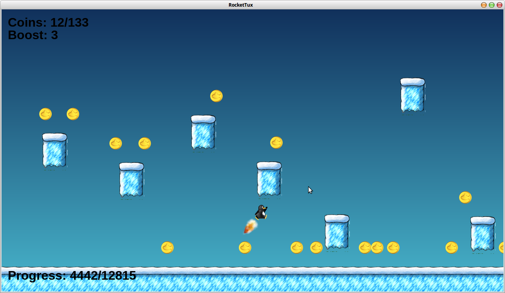

# The Prototype

RocketTux began as a bunch of scribbling in one of my notebooks, an idea born from a quirky bit of behavior I discovered when playing with platformer demo for Phaser 2. The two files in this directory, game.js and objects.js are all the first prototype of the game, based on that demo.  

The [screenshots](../../screenshots) folder has actually had some images of the prototype for years, as has my "screenshot blog" on [Google Drive](https://drive.google.com/open?id=0By31kDj_eHBceXgtS3hvdnJvT0U). My personal favorite is this one, where we can see that before Tux had a rocket pack, he had produced his own volatile gases.  

  

Anyway, I think the Git commit history of RocketTux is a decent educational resource, because it shows the path one hobby programmer took from "farts and a dream" to a game that's actually playable and fun. When I started RocketTux, I had been programming off and on for over twenty five years and I had been using GIMP and Blender for at least a decade, so the development of the game wasn't a "zero to hero" affair. That said, I hadn't before used Phaser and it shows, especially in my preference for procedural rather than object oriented programming (I use a class system to manage game states and functions for everything else). I've gotten better with Phaser over time and I've definitely made a lot of errors and course corrections over the years. Heck, there were two whole years where I simply too disappointed with what I made to even work on the project.  

While the final game may not be a grand master piece, it certainly does justice to its humble beginnings.  

- R. Bassett Jr. (Tatwi)