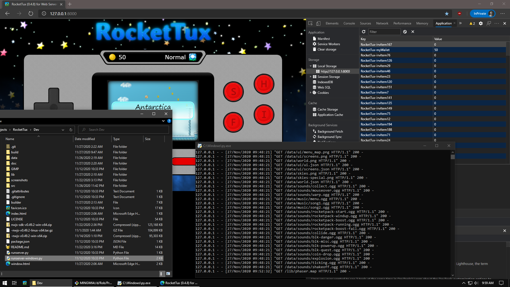

## Hosting with a Web Server  
RocketTux is, at its core, just a bunch of JavaScript that does all of its work client side. As such, it only needs a basic HTTP server to host its files in a way that a web browser will allow them to run properly. Here is how to do that in the most simple manner possible!    

### Windows
The following instructions are for using the Python web server that's built into Python 3. This was tested in Windows 10 using both the Google Chrome and Microsoft Edge (Chrome-based) browsers.  

1. Download and install Google Chrome.
2. In Chrome go to Settings > Advanced: Enable Hardware Acceleration. Restart Chrome when prompted.
3. Download and install [Python 3 for Windows](https://www.python.org/downloads/windows/).
4. Download RocketTux to your computer and extract the zip file. This will make a new folder called RocketTux-master. Double click on it.
5. Double click on **runserver-windows.py** and the server will run in a new window. 
 - If that doesn't work for some reason then follow these steps:
 - Right click on runserver-windows.py and choose "Open with IDLE".
 - Press F5 or click Run > Run Module from the menu to start the web server.
7. Open a new tab in Chrome and go to 127.0.0.1:8000 and it will automatically start the game (index.html).
8. When you're finished playing, close the browser tab and the Python window.  

**Modifying game save data in Windows:**  
 

### Linux
The following instructions are for using the Python web server in Debian/Mint/Ubuntu 64Bit Linux with the Google Chrome browser. The last time I tested this was with Debian 8 / Linux Mint 17.3 / Ubuntu 12.04 LTS, but the instructions will likely work fine in current Debian based distributions.  

- Install Python: sudo apt-get install python
- Download and install Google Chrome: 
    - Open a terminal window and issue the following commands
    - wget https://dl.google.com/linux/direct/google-chrome-stable_current_amd64.deb
    - sudo dpkg -i google-chrome-stable_current_amd64.deb
- Alternately, you can use the Chromium open source browser (which may or may not properly support WEBGL, depending on the build) by opening a terminal and issuing the following command.
    - sudo apt-get install chromium-browser
- Download RocketTux by clicking the "Clone or Download" button on this page and choosing "Download Zip".
- After the download is complete, cut and paste the RocketTux-master.zip file to a location on your computer where you would like the game to live and extract the zip file, such as in your home directory (/home/MYUSERNAME). It will create a new folder called "RocketTux-master" the contains the game files.
- Start the Phython Web Server:
    - Open a terminal window in the RocketTux-master folder, which is usually most easily done by clicking File > Open Terminal Here in the various file browsers, and issue the following command:
    - python -m SimpleHTTPServer
    - Alternately you can use the Python script (which conveniently displays the ip address of the computer) that I have included by typing the command:
    - python runserver.py
- Play the game:
    - Open Chrome and go to the following "website" (that is hosted on your computer and only accessible to computers on your home network): 127.0.0.1:8000/index.html

The web address 127.0.0.1 mean "localhost", aka the computer you're sitting. The :8000 is the port that the Python web server is listing for requests on. And index.html is the page that loads the game. The Python Simple Web Server only allows a single user at a time per port, so run the command again in another terminal using 8001 to accommodate another user. Alternately, you can install a web server such as [Apache](http://httpd.apache.org/docs/2.4/getting-started.html), which can host many concurrent users and can run automatically in the background, once configured.

Now that you have the game running, you can add a link for it on your desktop and have it open in its own window (rather than a browser tab) by doing the following:
- Click the menu icon in Chrome (right side of the window) and go to More Tools > Add to Desktop...
- Put a check beside "Open as window" and press OK. 
- Now you can play just by using the desktop icon! You may need to manually resize the window for the 16:9 ratio (intended for 1280x720 resolution).
- By default the icon looks very plain, so go ahead and change it by...
    - Right click the icon and select Properties. 
    - In the properties window, click on the plain looking icon and a window will open that will allow you to choose a different icon.
    - To use the icon included with RocketTux, choose "Image Files" in the "Select icon from:" drop down menu, then navigate to the folder where RocketTux lives. You will find the icon in the RocketTux-main/data/icons/ folder.
 

### Unsupported Devices
Anything that isn't a Windows or Linux PC with a keyboard, mouse, and (optional) gamepad, is not supported. That's not to say the game _can't_ work on other devices, just that I don't care if it does or does not. :)
